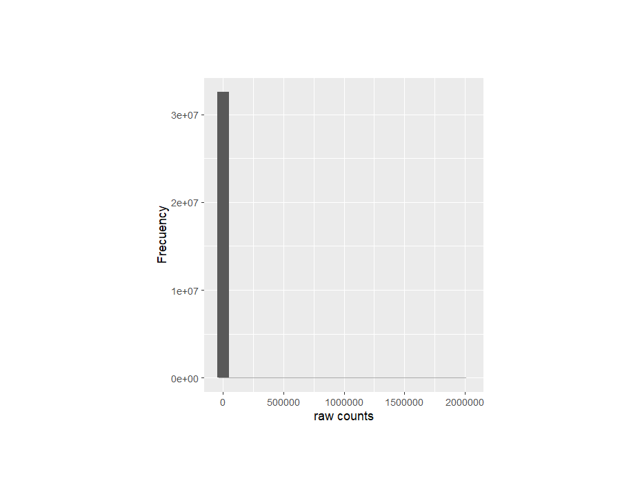
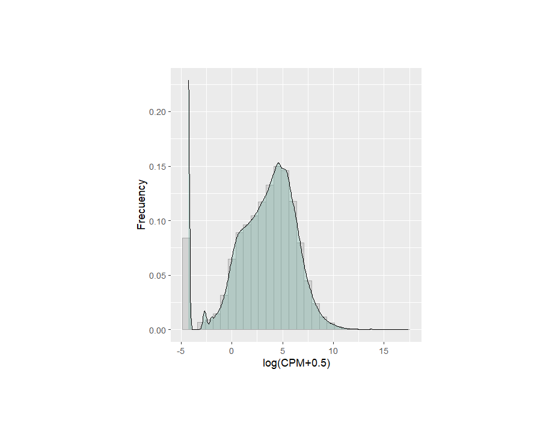
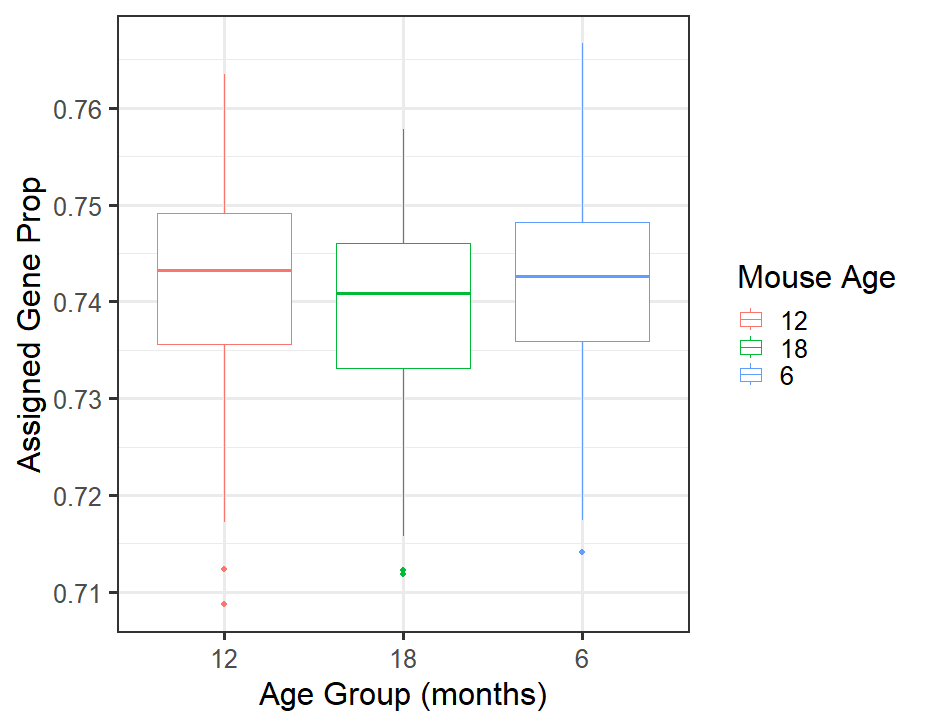
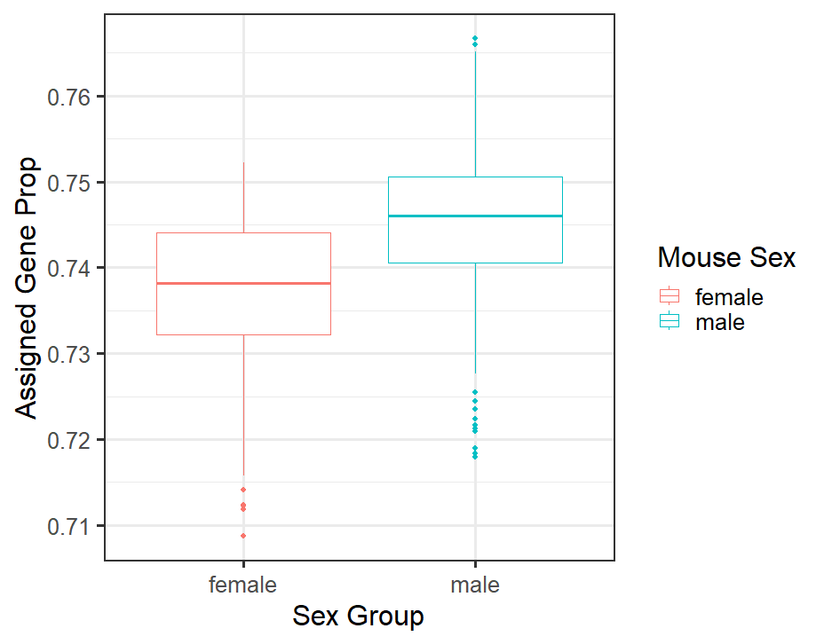
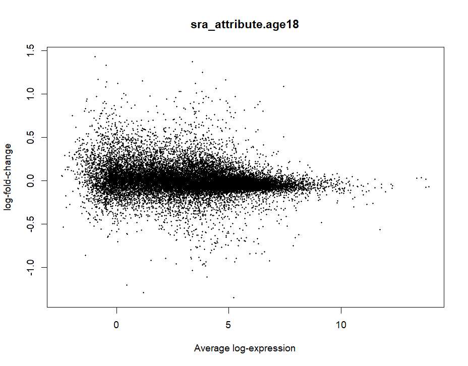
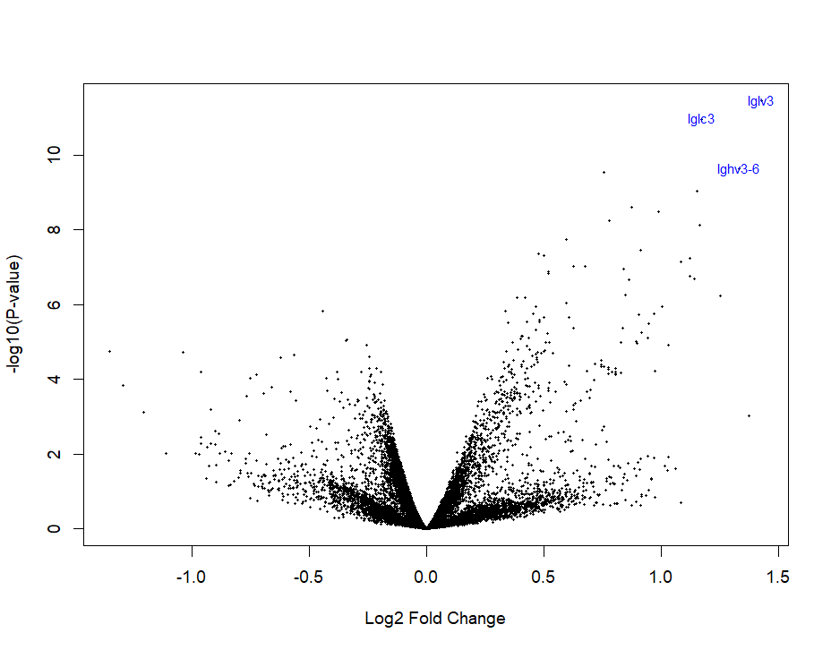
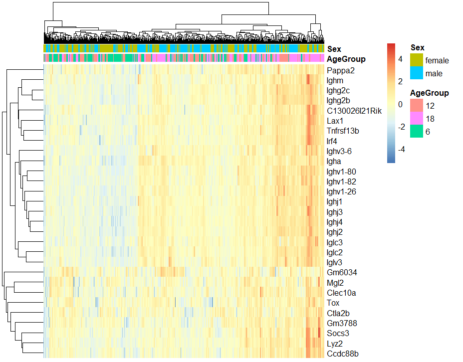

# Differential expression analysis

## Introduction 
This project is part of the course *Intro RNA-seq LCG-UNAM 2024*, which is an introduction to RANseq data differential expression analysis tools available at *Bioconductor*.
In the following report, I present the results of a differential expression analysis using the dataset *Transcriptomic profiling reveals distinct modes of aging in the kidney* (SRP165875).
This dataset was generated as part of a study amied at revealing the molecular mechanisms under the aging in the kidneys, obtaining 188 samples of mouse kidney at different life stages, that is, 6, 12 and 18 months of birth.

## Data retrieval
To retreive the data, I created a script calling the function `create_rse_manual` available at   `recount3`.

## Data preprocessing
Since filtering by expression and normalization are crucial steps in a differential expression analysis, I developed a script applying this processes to the rae data. Then I compared the data ditribution before and after the abovementioned transformations.

Data pre filtering:

Data post filtering:

## Variable analysis
Before making the differential expression analysis, I verified the relationship between the variables in the dataset.
First, I used a boxplot to visualize the effect of the age of the mouses in the assigned gene proportion:

Apparently, there are differences in the expression distribution across the three age groups. However, we have to perform other analysis to analyse the statistical significance of this difference.

Then, I checked wheter there was a biass in the assigned gene porportion due to the sex of the mouses:

There exist a clear difference in the assigned gene proportion due to the sex itself, so we have to include this variable in the model for the differential expression analysis.

## Differential expression analysis
Once I filtered the data and checked the effect of the age and sex variables, I started to perform the differential expression analysis.
To this end, I created the script *diffExp.R*, in which I use the package `limma` to fit a linear model to the normalized data.
The following plots show some of the results obtained in the analysis:

MA plot:

In this plot we can observe that theres a simmilar amount of upregulated and downregulated genes, and that the low expressed gened have a greater variance in their expression than the high expressed genes.

Volcano plot:

This plot shows us the variety of changes in expressions and its statistical significance. Interestingly, the three most significan results correspond to the genes *Iglv3, Iglc3 and Igvh3-6*. These genes belong to the inmunoglobulin protein superfamily, suggesting that the aging might have some effect on the inmunological response in mouse.

HeatMap: 

This heat map shows that there are no clear differences between the groups of the 12 and 18 months, but there is a slight difference of these with respecto to the group of six months. This could mean that the differences in the gene expression between young mice and adult mice is greater than the difference in the groups of two adult mice groups. That is, the older you get, the less your expression profile changes.

## Conclusion

